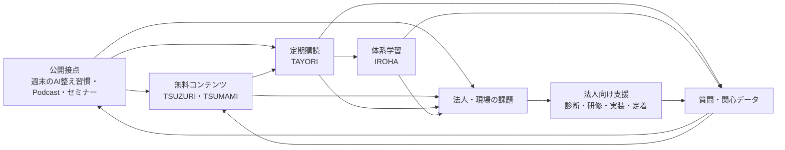

# ToToNoE+ 事業とサイトの全体像

更新日：2026年9月22日

対象：事業、サービス、マネタイズ、ホームページ、運営基盤

## 2026年9月22日：つまみのYouTube公開フロー（本番反映済み）

- StudioでYouTube URLを登録した動画は、TSUZURIと同じコラムHTMLを生成せず、つまみ｜TSUMAMIの動画カードへ直接反映する構成に変更。
- 共有URLは `tsumami/?video=YouTube動画ID` とし、開いたときに該当動画の再生画面を表示する。タイトルとサムネイルはYouTube oEmbedから取得し、説明・タグは必要な場合だけStudioで補足する。
- 公開確認は個別コラムHTMLではなく、公開JSONのリビジョンとつまみ一覧ページを対象にする。GitHub・API Worker・サイトWorkerへ本番反映済み。
- 動画「Anthropic公式コンテンツ！Claude Academyの活用方法」を、つまみの動画カードと `tsumami/?video=rAnUjlcZhW8` の直接再生URLで公開。

## 2026年9月22日：安全性とポリシーの点検（本番反映済み）

- 本番自動ビルドの設定パス欠落により、内部APIソースと会員HTMLが匿名で配信される状態を確認。正規の静的Workerへの再配信とWorkers Buildsのコマンド修正を実施し、内部ソース404・会員HTML302ログイン転送・API401を確認した。会員データの流出は確認していないが、過去ログ全体の調査完了を意味しない。
- 会員URLの表記違い、キャッシュ禁止、認証確認失敗時の応答を強化。Git連携反映後にも実行する公開チェックを追加。
- Base Craftas／ToToNoE+の個人情報、免責、特商法、キャンセル条件と問い合わせ・ログイン時の説明を補足。本番9ページがビルドと一致し、匿名公開チェック21項目が成功。手動反映Worker版は `b6cd17a2-30e2-4ce1-b15a-f3e86e021f50`、応答の識別子は `20260922-security`。
- 事業構造・料金・販売準備中の状態は維持。住所・電話の開示実務、海外処理契約、録画・共有権限、販売開始時の契約条件などは運営確認事項として残る。詳細は `../../docs/SITE_AUDIT_2026-09-22.md`。

位置づけ：本書を「ToToNoE+全体を理解するための統合情報源」とする。正式名称の細部は `SERVICE_NAMING.md`、個別機能の実装方法は各README・仕様書を優先する。

## 2026年9月22日：TOP・コンテンツ・サービスの4画像を刷新（本番反映済み）

- TOPの「自分のペースで学ぶ」に、つづり｜TSUZURIとつまみ｜TSUMAMIの横長ビジュアルを各タブへ追加。「学びを、実践へ。」では、たより｜TAYORIの既存画像を横長版へ変更し、いろは｜IROHAにも3キャラクターの横長ビジュアルを追加した。
- 同じ横長ビジュアルを、コンテンツページのつづり／つまみ欄と、サービスページのたより／いろは欄にも反映。PCでは各カード幅、スマートフォンでは1列のカード幅に合わせて16:9の全体が見える表示に統一した。
- 4画像はホーム表示用の1280×720px・透過WebPとして配信。制作PNG約8.8MBに対して配信用4画像は合計約828KBとなり、約91％軽量化した。制作PNGはローカル成果物として保持し、配信用WebPのみ公開アセットとして管理する。
- いろはは従来どおり「準備中」でリンクを設けず、たよりの申込準備中表示、各サービスの価格・提供内容・権限・公開範囲は変更していない。
- Cloudflare静的WorkerのVersion IDは `9b7fc858-aec3-4b4f-bddf-c686f6b5a7cf`。匿名ブラウザでTOP・コンテンツ・サービス各ページのPC表示と390px幅表示を確認し、公開HTMLが4画像と更新済みCSSを参照していることを確認した。

## 2026年9月17日：サービスとコンテンツの再編（本番反映済み）

9月16〜17日に実装した以下の変更は、ユーザーの公開指示により9月17日にCloudflare本番へ反映済み。公開URLのHTML・CSS・JS・木村プロフィール画像が配信ビルドと一致すること、準備中LPの302転送と会員ページのログイン制限を匿名取得で確認。本文の過去の状態と異なる場合は、この節の公開状態を優先する。

- サービス一覧は「たより」「いろは」「法人研修」「プロダクト」の4区分。閲覧できるサービスLPはたよりのみ。たよりの申込・課金状態は変更していない。
- いろは・法人研修・プロダクトは「準備中」として詳細リンクを非表示。既存のIROHA案内と法人向けページ、新規プロダクト下書きはローカルに保持するが、配信ビルドから除外する。直接URLはサービス一覧の該当項目へ302転送する。IROHAの既存会員向けページ・認可は変更しない。
- `contents.html`をコンテンツの入口に変更。左側に「セミナー・ポッドキャスト・アーカイブ」の切り替えボタンを置き、初期表示は開催予定のセミナーのみ。右側に「つづり・つまみ」を独立した欄として、それぞれ新しい順に最大3件表示する。コンテンツページ内の見出しはブランド名「つづり」「つまみ」、補足と共通メニューは「コラム」「動画コンテンツ」。開催予定・すべての先頭には、週末のAI整え習慣を公開サムネイルがあれば通常サイズ、なければ標準画像の小さな定期開催カードとして固定し、開催終了には表示しない。スマートフォンでは右欄を下に配置。公開記事がない場合は準備中と表示する。
- アーカイブとポッドキャストは既存の配信データを再利用。アーカイブのコメキャリ生限定・Googleアカウントの閲覧権限は維持。セミナーは既存の開催データを表示する。
- TOP、ヘッダー、フッター、今後生成される記事のメニューを上記区分に統一。朝活ページの既存過去回一覧も引き続き利用できる。
- 2026年9月17日、TOPをローカル実装後に調整。上部は既存メインビジュアルを元の比率で大きく表示し、画像内と重複する見出しは画面から除去（見出し自体は支援技術向けに保持）。直下にコンテンツ／サービスの2ボタン。本体は左に開催予定とコラム／動画のタブ（新着各最大3件）、右にサービス欄。TOP本文のPodcast・アーカイブ枠は撤去。たよりの画像は欄の横幅いっぱいに拡大し、案内公開中・申込準備中を明示。いろは・法人研修・プロダクトはリンクのない準備中枠。下部に既存の3人の集合画像を添えた「この世界観を知る。」とキャラクターページへの導線、チーム案内を配置。スマートフォンは縦に配置。
- TOPのセミナーはコンテンツページと同じ `seminars.js` と公開データを利用し、定期朝活を先頭に固定。公開サムネイルは `/public-content/weekend-event.json` を参照し、テーマ別画像があれば通常カードに拡大、未公開・取得失敗時は小さな標準枠。TOPでは通常カードを最大3件、コンテンツページでは全件表示。通常カード1件は大きく、2件は2列、3件以上はPCで3列（タブレット2列・スマートフォン1列）。終了時刻を日本時間で判定する。新着も共通データから取得する。共通メニューの表示名はコラム／動画コンテンツに統一。ブランド名・URLは変更しない。
- 法人研修・プロダクトの料金や提供詳細は未確定。下記の従来の法人相談導線・IROHAウェイトリストの説明は、今回の公開導線とは区別する。

```text
ToToNoE+
├─ サービス
│  ├─ たより｜TAYORI（サービス案内）
│  ├─ いろは｜IROHA（準備中・詳細非公開）
│  ├─ 法人研修（準備中・詳細非公開）
│  └─ プロダクト（準備中・詳細非公開）
└─ コンテンツ
   ├─ 左：セミナー / ポッドキャスト / アーカイブ（タブ切り替え）
   └─ 右：つづり｜TSUZURI / つまみ｜TSUMAMI（新着各3件）
```

- 2026年9月17日（本番反映済み）：つづり・つまみの見出しに、それぞれTSUZURI・TSUMAMIを併記。LINEスタンプはユーザー申告で販売開始済み。購入リンク（商品ID 36610674）はキャラクターページのみへ追加し、TOP・サービス一覧には追加しない。価格・決済・返金条件はLINE側の表示へ案内。プライバシー・特商法・キャンセルの3ページを、無料／会員限定／準備中／外部販売の区分に合わせて更新。販売事業者名はユーザー確認済みの「神藤 俊希」を反映。公開問い合わせメールはユーザー確認済みの `base.craftas478@gmail.com` を法務3ページに反映。木村倖晴のチーム紹介に添付プロフィール画像とX（`https://x.com/DxKimura`）を追加。サイト変更は本番反映済み。

## 1. 結論

ToToNoE+は、医療・介護・産業保健の専門職が、AIや情報に振り回されず、本当に大切な仕事と生き方に向き合える「余白」をつくるチームプロジェクトである。AIツールそのものを売るのではなく、情報を選び、理解し、試し、自分や現場に定着させる過程を支援する。

事業は次の3層で構成する。

1. **無料の接点と信頼形成**：週末のAI整え習慣、Podcast、つづり｜TSUZURI、つまみ｜TSUMAMI、セミナー。
2. **個人・チームの継続課金**：たより｜TAYORIで毎週の情報整理、いろは｜IROHAで体系的な学習と実践定着を提供する。
3. **法人向けの高単価支援**：現場の課題整理から診断、研修、実装、定着までを個別設計する。

現状は、無料の公開接点と法人相談は動いている。一方、TAYORIとIROHAの課金・会員運用は「実装とテスト基盤はあるが、本番販売は未開始」の段階である。今の最優先は新しいサービスを増やすことではなく、**無料接点 → TAYORI → IROHAまたは法人相談**の導線を、実際に販売・提供・継続できる状態に完成させることである。

## 2. 解決する問題

- AIの変化が早く、情報を追うだけで時間を使う。
- 情報は得られても、自分の仕事にどう置き換えるかが分からない。
- 学んでも一回限りになり、習慣や業務の変化までつながらない。
- 書類、議事録、情報共有、教育、マニュアルなどの負担により、専門職が本来向き合いたい人や仕事に時間を使いにくい。
- AI導入が目的化し、安全性、現場適合、運用ルール、内製化が後回しになる。

ToToNoE+の価値は「AIでできることを増やす」だけではない。情報と業務を整え、最後は人が「何を大切にするか」を選べる状態をつくることにある。

## 3. 誰に何を届けるか

| 顧客 | 主な状態 | 提供価値 | 主な入口 | 次の提案 |
|---|---|---|---|---|
| 医療・介護・産業保健の専門職 | AI情報を追えない、活用に転換できない | 選び直された情報、現場に引き寄せた解説、小さな実践 | 朝活、Podcast、TSUZURI、TSUMAMI | TAYORI、IROHA |
| 継続的に情報を受け取りたい個人 | 情報収集に時間をかけたくない | 週次資料、解説動画、会員Q&A、優先質問 | TAYORI LP | TAYORI月額会員 |
| AIを体系的に学びたい個人 | 断片的な学びを実践につなげにくい | カリキュラム、週間計画、実績、振り返り、TAYORIの全特典 | IROHAの案内 | IROHA入会＋月額 |
| 同じ情報を共有したいチーム | メンバーの情報差が大きい | 必要人数への共通情報配信 | TAYORI法人案内 | Teamプラン・個別相談 |
| 医療・介護事業者、産業保健・人事労務組織 | 業務負担、属人化、AI導入の進め方が不明 | 課題可視化、研修、仕組みの実装、運用定着 | 30分無料相談 | 個別見積もりの法人支援 |

## 4. サービス全体図



中心は「発信して終わる」ことではない。朝活・記事・動画で接点をつくり、TAYORIの質問や法人相談から実際の困りごとを受け取り、次の朝活・記事・学習コンテンツに戻す。無料発信、継続課金、法人支援を、同じ課題理解から生まれる一つの循環にする。

## 5. サービスの役割と現在地

| 名称 | 役割・提供物 | 収益上の役割 | 2026年9月14日現在 |
|---|---|---|---|
| 週末のAI整え習慣 | 毎週土曜6:00〜6:30の無料朝活、Podcast、アーカイブ | 信頼・参加・ニーズ発見 | 公開中。Podcastはローカルデータ上17回。アーカイブはコメキャリ生限定の案内 |
| たより｜TAYORI | 週次資料、短い解説動画、会員Q&A、週1回の優先質問 | 個人月額と将来のTeam月額 | 本番に月額980円の職種共通1プラン、14日間無料、人数上限なしのウェイトリストを反映済み。Checkoutは停止中 |
| つづり｜TSUZURI | 考えと実践を記事として蓄積・共有 | 無料集客、信頼形成、他サービスへの送客 | 公開頁と編集基盤あり。ローカル台帳は4件、公開JSONは確認時0件で差がある |
| つまみ｜TSUMAMI | AIの要点を短い動画・PDF・スライドで提供 | 無料集客、試用価値、他サービスへの送客 | 公開中。ローカルの固定動画データは3件 |
| いろは｜IROHA | AIリテラシー、ツール別活用、週間学習計画、実績と振り返り | 入会金＋月額継続課金 | 公開ナビで準備中。本番案内ページに職種共通プラン、資格確認廃止、個人・法人別ウェイトリストを反映済み。法人料金は準備中 |
| 法人向け支援 | 診断、研修、Google Workspace・GAS・AIを使った実装、定着 | 無料相談からの個別見積もり | 法人ページと医療・介護／産業保健の相談フォームを公開中 |

## 6. マネタイズポイント

### 6.1 現時点の価格設計

| 収益源 | 価格・課金形式 | 位置づけ | 販売状態 |
|---|---|---|---|
| TAYORI 個人 | 月額980円税込、14日間無料 | 低単価の継続接点 | 本番案内・人数上限なしのウェイトリスト反映済み。決済開始前 |
| TAYORI Team | 10名5,000円／20名10,000円／50名15,000円／100名25,000円、101名以上は個別相談 | 席数型のチーム売上 | 公開LP上の「現時点の料金案」。申込準備中 |
| IROHA 初回 | 職種共通の入会金9,800円。月額は初回30日間無料 | 初期価値とオンボーディング | 本番案内・ウェイトリスト反映済み。決済開始前 |
| IROHA 継続 | 月額2,980円税込。職種共通 | 学習継続とTAYORIを含むストック収益 | 本番販売前 |
| IROHA 再入会 | 職種共通の再入会金4,800円。無料期間なし | 再開時のオンボーディング | 本番販売前 |
| IROHA 法人 | 準備中 | 組織向け学習支援 | 本番でウェイトリストのみ受付 |
| 法人向け支援 | 30分無料相談後の個別見積もり | 高単価のフロー収益 | 相談受付中。ToToNoE+固有の料金表は未確定 |

表示金額と販売可能状態は別である。価格がコードやLPにあっても、本番決済と提供運用が通っていることは意味しない。

### 6.2 収益構造の特徴

- **入口は無料、継続価値は有料**：朝活や公開コンテンツで信頼をつくり、定期的な情報整理と学習定着に課金する。
- **サブスクと個別支援の二本柱**：TAYORI・IROHAは収入の予測可能性を高め、法人支援は大きな個別課題に応える。
- **IROHAがTAYORIを内包**：IROHA購入者には `curriculum_all_access` と `weekly_access` の両方を付与する。TAYORIからIROHAへのアップグレードを設計できる。
- **同じ調査を複数の形で価値化**：週次の調査・解説を、朝活、Podcast、TAYORI資料、TSUZURI記事、TSUMAMI動画へ展開する。
- **質問が次の商品開発データになる**：優先質問、朝活参加者の声、法人相談を、次の解説・教材・研修設計へ戻す。

## 7. 顧客導線と価値階段

**個人**

公開記事・SNS・紹介 → 週末のAI整え習慣 → Podcast・TSUZURI・TSUMAMI → TAYORI LP → 14日間無料 → TAYORI月額 → 必要に応じてIROHA

**チーム・法人**

朝活・セミナー・記事・紹介 → TAYORI Teamまたは30分無料相談 → 課題確認 → 診断 → 研修 → 実装 → 定着 → 継続支援

現状の導線には次の切れ目がある。

- 無料参加後に「次に何を選ぶか」が一意でない。
- TAYORIに価格はあるが、現在は申込が無効で、需要を売上へ変えられない。
- IROHAは内部実装が先行し、公開説明と提供開始条件が追いついていない。
- 法人相談は開いているが、相談 → 提案 → 見積もり → 受注 → 継続の全体台帳はリポジトリ内で確認できない。
- ToToNoE+法人支援とBase CraftasのCraft Flowには、AI研修・業務改善・GAS実装などの重なりがある。

## 8. ホームページの構造

```text
Base Craftas
└─ プロジェクト
   └─ ToToNoE+
      ├─ TOP                         全体の入口、最新セミナー、4サービス
      ├─ 週末のAI整え習慣          無料朝活、Podcast、アーカイブ、参加導線
      ├─ サービス
      │  ├─ たより｜TAYORI          公開LPと会員ログイン案内
      │  ├─ つづり｜TSUZURI         公開記事一覧
      │  ├─ つまみ｜TSUMAMI         短い動画・資料
      │  └─ いろは｜IROHA          準備中。案内ページで個人・法人ウェイトリストを受付
      ├─ 法人向け支援              無料相談、診断・研修・実装・定着
      ├─ キャラクター              理念を物語と対話で伝える3人
      ├─ チーム                    理念と運営メンバー
      ├─ FAQ
      └─ 法務・ポリシー          プライバシー、特商法、解約・返金
```

| 役割 | ローカルパス | 公開URL |
|---|---|---|
| TOP | `projects/totonoe/index.html` | `https://basecraftas.com/projects/totonoe/` |
| 週末のAI整え習慣 | `projects/totonoe/weekend-ai.html` | `https://basecraftas.com/projects/totonoe/weekend-ai.html` |
| サービス一覧 | `projects/totonoe/service.html` | `https://basecraftas.com/projects/totonoe/service.html` |
| TAYORI LP | `projects/totonoe/tayori.html` | `https://basecraftas.com/projects/totonoe/tayori.html` |
| TAYORI会員画面 | `projects/totonoe/TAYORI/` | `https://basecraftas.com/projects/totonoe/TAYORI/` |
| TSUZURI | `projects/totonoe/tsuzuri/` | `https://basecraftas.com/projects/totonoe/tsuzuri/` |
| TSUMAMI | `projects/totonoe/tsumami/` | `https://basecraftas.com/projects/totonoe/tsumami/` |
| IROHA | `projects/totonoe/IROHA/` | 準備中の料金案内と個人・法人ウェイトリストを公開 |
| 法人向け | `projects/totonoe/corporate.html` | `https://basecraftas.com/projects/totonoe/corporate.html` |
| 運営チーム | `projects/totonoe/team.html` | `https://basecraftas.com/projects/totonoe/team.html` |
| FAQ | `projects/totonoe/faq.html` | `https://basecraftas.com/projects/totonoe/faq.html` |

### ページごとの役割

- **TOP**：「誰のための何か」と、今参加できるものを短時間で伝える。
- **週末のAI整え習慣**：無料で体験し、内容の質と運営者への信頼を確かめる。
- **TSUZURI・TSUMAMI**：検索、SNS、過去コンテンツから新しい利用者と接点をつくる。
- **TAYORI LP**：無料発信と有料会員の違いを示し、購入判断を支える。
- **TAYORI・IROHA会員画面**：購入後の価値提供、継続理由、利用状況をつくる。
- **法人向けページ**：個人向け学習では解けない現場課題を相談に変える。
- **キャラクター・チーム**：「整える」の思想、物語、運営の信頼を補完する。

## 9. 運営・システムの全体像

| 基盤 | 担うこと | 主な技術・保管先 | 現状 |
|---|---|---|---|
| 公開サイト | サービス説明、無料コンテンツ、参加・相談導線 | 静的HTML/CSS/JS、Cloudflare | 主要ページを公開中 |
| ToToNoE+ Studio | TSUZURI記事、YouTube動画、次回朝活情報の登録・公開 | Cloudflare Access、Worker、D1、R2、GitHub | 運営基盤あり。2026年9月14日から指定2アカウントだけを固定管理者として扱う。公開動線ごとの確認が必要 |
| 公開朝活情報 | 次回サムネイルと情報を匿名閲覧者へ配信 | `/public-content/weekend-event.json` | 2026年9月13日確認時HTTP 200、`event:null` で既定表示 |
| TAYORI会員基盤 | ログイン、契約権限、週次資料、質問、回答動画、プロフィール | メール認証、D1、Google Drive、Google Sheets、Worker | メール認証APIは本番稼働中。課金は14日無料設定まで本番Workerへ反映済みだが、販売は未開始 |
| IROHA学習基盤 | 教材、週間計画、進捗、振り返り | D1、制限付きDrive、Worker | 資格確認導線はローカルで廃止。実Drive同期・本番データ・公開導線は未完了 |
| 課金・売上管理 | Checkout、Webhook、権限付与、解約、返金、売上サマリ | Stripeサンドボックス、D1、Worker、運営ダッシュボード | TAYORIの14日無料設定と管理者限定のテスト表示リセットは本番Worker反映済み。`STRIPE_MODE=test`、`STRIPE_CHECKOUT_ENABLED=false`のため本番売上を生む状態ではない |
| コンテンツ配信 | 週次資料、回答動画、朝活アーカイブ、期限管理 | 毎時同期、土曜9:00 JST同期、Drive、D1 | 2つのCron設定。本番の各フローは別途通し確認が必要 |

## 10. Base Craftasとの関係

ToToNoE+はBase Craftas公式サイト配下の「代表が主体で関わるプロジェクト」で、Base Craftasの3つの主要法人サービスとはサイト上分けている。

- Craft Growth：採用ブランディング・人と組織の成長
- Craft Flow：AI導入・業務改善・GAS等のアプリ実装
- Craft Vital：健康経営・働く人の健康支援

ToToNoE+の独自性は、専門職コミュニティ、週次の発信と学習、キャラクターと物語、現場から考える思想にある。一方、法人向け支援の「診断・研修・実装・定着」はCraft Flowと重なる。対外的には次のどちらかを決める必要がある。

1. ToToNoE+を専門職コミュニティと学習のフロントブランドとし、契約・実装はCraft Flowが担う。
2. ToToNoE+に法人支援を独立商品として持たせ、Craft Flowとは対象・範囲・契約主体を分ける。

現状の実装だけでは、この経営判断は確定していない。

## 11. 現在地のステータス

| 区分 | 確認できたこと | 意味 |
|---|---|---|
| 公開中 | TOP、サービス一覧、週末のAI整え習慣、TAYORI LP、法人向け支援は公開URLでHTTP 200 | 認知・参加・相談の入口はある |
| 公開上の準備中 | TAYORIの申込ボタンは無効。IROHAは準備中表示で詳細URLも一覧へ転送 | 継続課金はまだ公開の売上導線ではない |
| 法人相談 | 医療・介護向けと産業保健向けのGoogleフォーム導線あり | リード取得は可能。受注・売上実績は未確認 |
| ローカル実装 | 会員UI、認証、課金、権限、配信、質問、請求サマリ、受付枠、ウェイトリストのコードとテスト | 本番反映、DB移行、外部サービスE2Eは別の完了条件 |
| コンテンツ差分 | ローカル `data/contents/index.json` は4件、公開版は0件 | 公開用データの反映・公開操作を確認する必要がある |
| 次回朝活情報 | 匿名エンドポイントはHTTP 200、`event:null` | 障害ではなく、次回イベントがないときの既定状態 |

**未確認**：実売上、実契約数、無料朝活からの転換率、本番購入、月次解約率、顧客生涯価値、法人商談からの受注率、法人支援の実原価。これらを仮の数値で埋めない。

## 12. これから向かう方向

### 第1段階 販売できる一本の導線を完成させる

- TAYORIの申込前表示、メール認証、Stripeテスト決済、Webhookの権限付与、会員画面、解約、期限後ロックまでを通す。
- テスト決済後に本番秘密情報、税、表示、規約、サポート運用を確定し、承認後に公開する。
- 無料朝活と公開コンテンツから、関心に合うTAYORIの説明へ送る。

### 第2段階 継続する理由を運用で作る

- 毎週の資料、解説動画、優先質問、回答動画の発行リズムを固定する。
- 購入者数だけでなく、閲覧、ダウンロード、質問、解約予約を見る。
- 質問を個別回答で消費せず、類似テーマをまとめて会員全体の学びに戻す。

### 第3段階 IROHAと法人支援へ深める

- TAYORIだけで解決しにくい「体系的に学ぶ」需要をIROHAへつなぐ。
- 個人の情報収集では解けない「組織の業務・ルール・教育」を法人支援へつなぐ。
- Craft Flowとの重なりを整理し、顧客が迷わない受付・契約ルールを定める。

## 13. 今決めること

| 優先度 | 決めること | 理由 |
|---|---|---|
| P0 | TAYORIの本番販売開始日と、開始時に保証する提供内容 | 現在は価格と価値は見えるが買えない |
| P0 | TAYORIの本番E2E完了条件 | 誤課金、誤権限、資料非表示を防ぐ |
| P0 | ToToNoE+法人支援とCraft Flowの関係 | ブランド、見積もり、契約主体の曖昧さをなくす |
| P1 | TAYORI Team価格と管理方式の正式化 | 席数、追加・削除、請求、管理者権限が未定義 |
| P1 | IROHAの初期カリキュラムと公開条件 | 「誰が、何を、どこまで学べるか」を先に約束する |
| P1 | 転換と継続の計測定義 | 売上だけでなく価値提供を判断できるようにする |
| P2 | 無料コンテンツと有料特典の境界 | 無料の信頼形成と有料の継続理由を両立する |

## 14. 管理すべき指標

| 段階 | 主指標 | 分母・注意 |
|---|---|---|
| 認知 | サービス別閲覧数、初回流入元 | ボットと運営者アクセスを分ける |
| 関心 | 朝活詳細、TAYORI LP、法人支援への移動 | CTAクリックと申込完了を分ける |
| 参加 | 朝活申込数、参加数、初回・継続参加 | 申込者を参加者とみなさない |
| 無料から有料 | 認証開始、Checkout開始・完了、トライアル開始、有料化 | 転換率は前段階の実数を分母にする |
| 利用 | 資料閲覧、ダウンロード、動画再生、質問投稿 | 契約者数だけでなく活性利用者数を見る |
| 継続 | MRR、有料会員数、トライアル転換率、解約率、平均継続月数 | IROHA会員のTAYORI権限をTAYORI課金者として二重計上しない |
| 法人営業 | 相談、相談実施、提案、受注、受注率、平均受注額、継続率 | 領域と流入サービスを分ける |
| 価値 | 実践率、現場活用率、創出時間、学習目標達成 | 自己申告と実測を分け、分母と期間を明記する |

## 15. 情報の確度

- **確認済みの事実**：現行のHTML、JavaScript、Worker、設定、仕様書、公開URLの応答から確認できたこと。
- **設計済みだが本番未完了**：ローカルにUI・API・テストがあるが、本番の購入・外部データ・権限・解約までを通していないもの。
- **経営上の解釈・提案**：「無料 → TAYORI → IROHA／法人支援」を主導線とすること、優先順位、Craft Flowとの整理方針。現行資産と会話履歴から導いた現時点の整理であり、経営決定後に更新する。

## 16. 更新ルール

本書の更新は、ToToNoE+関連の実装・反映作業の完了条件に含める。次のどれかが実際に実装または反映されたときは、同じ作業内で本書も更新する。

- サービス名、提供内容、価格、無料期間、包含関係。
- 準備中、販売開始、試験提供、一時停止などの公開状態。
- 無料から有料、TAYORIからIROHA、個人から法人への導線。
- 課金、認証、配信、コンテンツ公開の本番状態。
- ToToNoE+とBase Craftas各サービスの役割分担。

アイデア出し、方針検討、未承認の案、確定前の価格や提供条件は、まだ本書に反映しない。実装・公開・運用反映が確定した時点で更新する。ただし、従来の全体像を明確に覆す経営決定が行われた場合は、実装前でも「決定済み・未実装」として区分して記録できる。

更新時は「表示文言」「価格コード」「権限」「決済設定」「公開ページ」を別々に確認し、一つの変更で全てが更新済みとはみなさない。

本書の更新が不要だと判断した場合は、作業完了報告で「全体の事業・サイト構造に変更がないため更新不要」と分かるようにする。

## 17. 参照先

- 正式名称・提供内容：`projects/totonoe/SERVICE_NAMING.md`
- サイト運用：`projects/totonoe/README.md`
- TAYORI会員サイト：`projects/totonoe/WEEKLY_MEMBER_SITE_SPEC.md`
- IROHAプロトタイプ：`projects/totonoe/IROHA/README.md`
- IROHAのDrive設計：`projects/totonoe/IROHA/DRIVE_SETUP.md`
- 課金定義：`apps/tsuzuri-studio-api/src/billing.js`
- 運営API：`apps/tsuzuri-studio-api/README.md`
- 公開ビルド範囲：`scripts/build-site.mjs`
- 過去のBase Craftas全体監査：`00_GitHubに入れない_ローカル専用/検討・監査記録/HP_STATUS_AND_MONETIZATION_2026-09-09.md`

## 2026年9月17日 公開検証記録

- 静的サイトWorker `basecraftas`：`f734ff43-3a0c-4403-b68f-8431c5698930`
- 記事配信API `column-studio-api`：`69bd2813-3b9a-456b-b834-b8f17e080447`
- `npm test`：91件成功。両Workerのdry-run成功後にデプロイ。
- TOP、コンテンツ、サービス、チーム、キャラクター、法務3ページ、主要CSS/JS・画像・生成記事を匿名取得してローカル配信物との一致を確認。
- IROHA・法人研修・プロダクトLPは302転送。IROHA会員画面の未認証アクセスはログインへ302。
- Stripeは従来どおりtest・新規決済受付無効。今回の公開は課金開始を意味しない。

## 2026年9月17日 AIニュース下書きの冒頭図版

- StudioのAIニュース下書き7本（最新Googleスライド `8_9_12` に対応）を、導入文 → 採用スライドJPEG → 解説開始の一文 → 既存本文の順へ更新。1600×900px・約240〜342KBの既存JPEGを記事所有素材として登録。
- リビジョン競合確認と編集履歴保存を行い、7本とも共有下書きのまま保存・読み戻し確認。一般公開は未実施。公開中のキャラクター物語4本は変更していない。
- 公開記事レンダラーとStudioの図版・キャプションCSS、長いURLの折り返しをローカル実装。これらのコード変更は未デプロイ・未push。

## 2026年9月19日 週末のAI整え習慣 第17回（本番反映済み）

- Podcastに第17回「AIが面接？Xで話題の"なりすまし面接" とAI機能統合の流れ」（stand.fm、9/19）を追加。
- コメキャリ生限定アーカイブに、第17回のDriveファイル（`1c4FYxTu2-o_HIsT1hKJE56sE4W-0Ma-A`、9/19）を追加。既存のGoogleアカウント閲覧権限は維持。
- Cloudflare静的Workerへデプロイ後、匿名ブラウザでPodcastカード（stand.fm埋め込みを含む）とアーカイブカード（Driveプレビュー導線を含む）の第17回表示を確認済み。
